# Week 1 - Setup and Version Control Pipeline

### Project Context and Production Framework

The primary objective for this 10-week cycle is to develop and publish a multiplayer game to Steam. To accurately emulate a real-world studio environment, the course is structured as a professional company simulation. My assigned role heavily focuses on technical production specifically architecting asset integration pipelines, managing version control for non-technical staff, and handling the Steam backend administrative tasks.

Going into pre-production, we were provided with a client brief detailing the game's style and parameters. We established that we are developing a multiplayer card game, mechanically and thematically inspired by titles such as ***(Liar’s Bar on Steam, s.d.)*** and traditional rulesets like ***(Cheat / I Doubt It - Card Game Rules, s.d.)***. Because of the rapid development cycle and the complexity of coordinating multiple disciplines, robust pre-planning was essential before moving into the engine.

To formalize our studio hierarchy and ensure clear communication, we adopted standard project management methodologies, starting with a RACI chart. This matrix explicitly defines who is Responsible, Accountable, Consulted, and Informed across every major project milestone.


*Figure 1. RACI Chart established during the initial sprint planning to map out studio responsibilities.*

### Identifying the Pipeline Bottleneck

With the administrative foundation set, I immediately began developing my first technical tool. Anticipating a very common production bottleneck, I recognized that our 2D artists and 3D animators would likely experience high friction when interacting directly with Git and GitHub. Version control command-line interfaces (CLIs) and desktop clients can be overwhelming for non-programmers, often leading to merge conflicts, misnamed directories, or lost assets. 

To mitigate this risk, I set out to engineer a frictionless middle-man tool: a Discord Bot that allows artists to push assets directly into our repository from an environment they already use daily.

# Week 2: Unreal Engine Steamworks Integration

Because our client brief specifies that the final product will be distributed on Steam, we cannot rely on Unreal Engine's default LAN networking for our production tests. To ensure our network testing accurately reflects the final production environment, I needed to integrate the Steamworks Online Subsystem into our Unreal project pipeline *(Epic Games, s.d.)*.

#### 1. Engine Configuration (`DefaultEngine.ini`)

To route Unreal's session interfaces through the Steam API, I had to expose and configure the `OnlineSubsystemSteam` module. I modified the project's `DefaultEngine.ini` file to declare Steam as the default platform service. 

**Key Technical Decision:** Since we do not yet have our official Steam App ID for the game, I utilized the spacewar App ID (`480`) to establish the handshake with Steam's backend. This allows the engine to piggyback off the Steam overlay and utilize their relay network (Spacewar/test server masking) for our initial server hosting tests.

I also configured the `CrashReportClient` settings to ensure that when the game inevitably crashes during testing, the logs are formatted and routed correctly, providing a foundation for future QA pipelines, a critical component of modern engine architecture *(Gregory, 2018)*.

```

[OnlineSubsystem]
DefaultPlatformService=Steam

[OnlineSubsystemSteam]
bEnabled=true
# Steam APPID should go here once we get it
SteamDevAppId=480
bInitServerOnClient=true

[CrashReportClient]
bAgreeToCrashUpload=false
bSendUnattendedBugReports=false
CompanyName="[GreedyPiggies]"
DataRouterUrl="[https://dot.nj.gov/transportation/refdata/accident/selfreporting.shtm](https://dot.nj.gov/transportation/refdata/accident/selfreporting.shtm)"
UserCommentSizeLimit=4000
bAllowToBeContacted=true
bSendLogFile=true

[/Script/SteamSockets.SteamSocketsNetDriver]
NetConnectionClassName="/Script/SteamSockets.SteamSocketsNetConnection"

```

#### 2. Prototyping the Session Architecture (Blueprints)

With the `.ini` configured, I moved into the engine to build the user interface and logic required to test the Steam connection. I created a basic placeholder menu widget (`WBP_MultiplayerMenu`) containing the necessary UI binds to host and join a session.

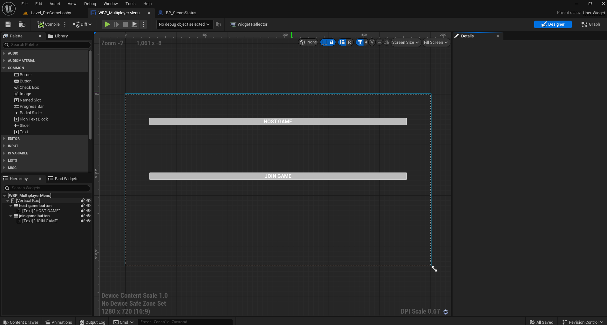
*Figure 4. Placeholder UI for the WBP_MultiplayerMenu, allowing users to interact with the Steam session nodes.*

To drive this UI, I authored two core Blueprint scripts to handle the Steam status and session management:

**Blueprint: `BP_SteamStatus`** This logic checks the initialization of the Steam Subsystem upon launch, verifying that the client is successfully logged in and communicating with the Steam backend.

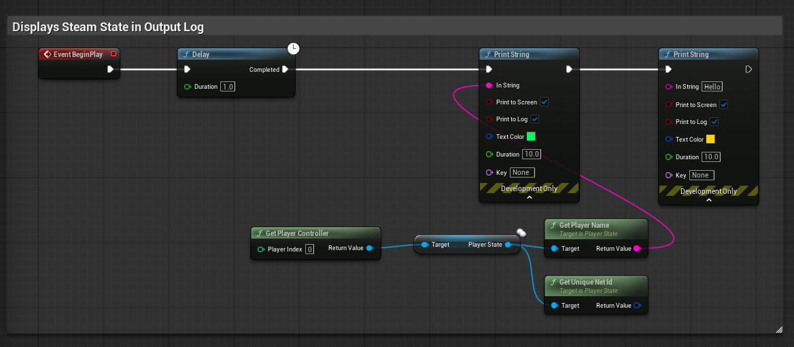
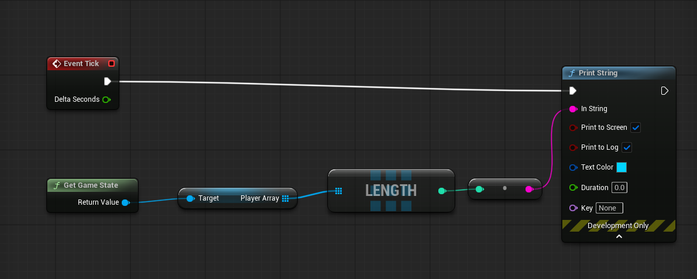

**Blueprint: `WBP_MultiplayerMenu` Logic** This handles the creation of a listen server and queries Steam for active lobbies, using Unreal's asynchronous `Create Session` and `Find Sessions` nodes.

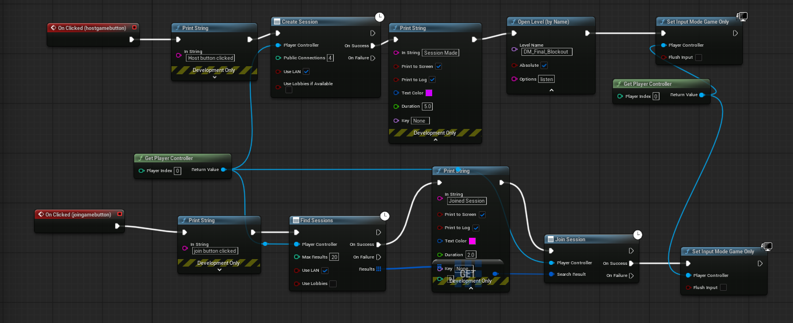
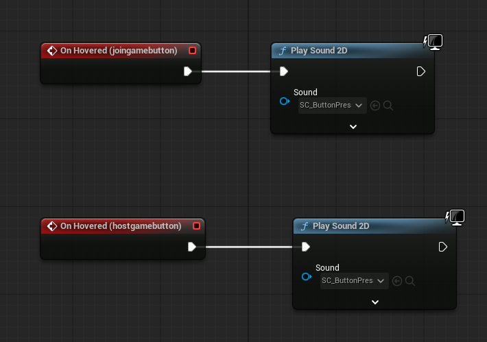

### Reflection and Next Steps

The successful implementation of the Steam Subsystem this week was a major pipeline milestone. Being able to host and join a server via Steam using a placeholder App ID proves our network architecture is viable before we write any complex gameplay code. 

My next objective will be to expand on the `WBP_MultiplayerMenu` to parse the array of found sessions and display them dynamically in a server browser list, rather than relying on a direct join test. I will also monitor the updated Discord bot to ensure the error handling holds up as artists begin pushing heavier assets into the repository.


# Week 3 - Studio Recordings & Multiplayer Sessions

### Production Context & Pre-Planning

This week shifted focus away from active engine development and towards a mix of technical auditing, pipeline security, and hands-on asset production. Before committing our Discord-to-GitHub asset ingestion tool (developed in Weeks 1 and 2) to a permanent production environment, it was mandatory to evaluate it from a networking, security, and compliance perspective. 

Concurrently, I used the remainder of this week to begin the architectural planning for our Unreal Engine networking framework, mapping out the RPCs (Remote Procedure Calls) and variable replication needed to sync gameplay states across clients for next week's sprint.

### Audio Production Pipeline: Studio Recording

Alongside my technical and managerial duties, I took a hands-on role in the project's audio production this week. Recognizing the need for bespoke, high-quality voice lines to give our *Liar's Bar*-inspired characters distinct personalities, we booked out the on-campus recording studio for an entire day of uninterrupted tracking.

Acting as the session engineer, I utilized the studio's acoustic environment and operated Logic Pro as our primary Digital Audio Workstation (DAW). This process involved managing the physical microphone setups, actively monitoring input gain levels to prevent audio clipping during louder vocal takes, and organizing the recorded stems within Logic's timeline. Capturing high-fidelity, uncompressed audio is critical for modern game development, as low-quality source files cannot be "fixed" later in the engine. 

Following the day-long session, these raw recordings had to be bounced, properly named according to our project's naming conventions, and prepared for engine integration. This cross-discipline involvement not only expanded my production skill set but also practically reinforced the necessity of our Discord asset pipeline, as we now had gigabytes of raw audio data that needed a frictionless path into our version control repository.


### Week 5: Server Browser and Player ID Resolution

Alongside the gameplay networking, I revisited the multiplayer UI architecture established in Week 2. During initial playtesting of our Steam integration, we encountered a critical bug: when clients joined a hosted server via the server browser, their Player IDs (Unique Net IDs) were not being assigned or passed correctly, breaking player identification in the lobby.

I traced the issue to how the session data was being parsed within the UI widget. I upgraded the `WB_ServerBrowserItem` blueprint to properly handle the `Blueprint Session Result`. 

**The Fix:** When the list populates, the widget now explicitly extracts and stores the correct Session ID and host data. When the client clicks "Join," the widget reliably passes this verified session reference to the `Join Session` node, ensuring the Steam Online Subsystem successfully negotiates the connection and properly registers the client's Unique Net ID upon entering the server *(Epic Games, s.d.-b)*.


*Figure 8. Upgraded WB_ServerBrowserItem logic, demonstrating the correct extraction and passing of session data to ensure Player IDs initialize correctly on join.*

### Reflection and Next Steps

This week successfully bridged the gap between pipeline tooling and gameplay programming. Refactoring the `BP_Dealer` to rely on server authority secures the integrity of our game, and fixing the server browser UI ensures players can actually connect to test it. Moving into Week 5, my goal will be to finalize the lobby transition sequence so that once all players have successfully joined the session with their correct IDs, the server can seamlessly seamless-travel everyone into the active game map.

# Week 5: State Synchronization and Gameplay Replication

Returning to the Unreal Engine project, Week 5 was a heavy production sprint focused on the complexities of network replication. With our Steam session architecture successfully establishing connections last week, the primary objective was now syncing the actual gameplay state-specifically card dealing, turn orders, and scoring-across all connected clients.

#### Synchronizing the Dealer and Turn Management

In a multiplayer card game, enforcing a strict "Server-Authoritative" network model is non-negotiable. If clients are trusted to manage their own decks, hands, or turn states, the game becomes fundamentally vulnerable to desynchronization and malicious exploitation (cheating) *(Ruiz, 2017)*. 

Building upon the `BP_Dealer` blueprint introduced previously, I engineered a highly deterministic turn-based flow. The server holds the absolute truth regarding the deck array and a tracking integer representing the current active player's turn. 

When a client attempts to draw a card or play a hand, their input sends a "Run on Server" Remote Procedure Call (RPC). The server does not blindly accept this request. Instead, it first checks the turn integer to validate if it is legally that player's turn. Only if this server-side validation passes does the server modify the deck array and deal the card. This ensures "dumb clients", they only request actions and display visual results, while the server handles all logical arbitration.


*Figure 9. BP_Dealer logic expanding on the Server-Authoritative turn validation. Notice the strict gating logic where the server acts as the absolute arbiter of game flow.*

#### Replicating Player State: RepNotify vs. Multicast

To handle persistent player-specific data, such as tracking individual points, I utilized the `BP_FirstPersonCharacter_HarryTesting` blueprint. A critical production requirement was ensuring that when a player scores, every other client's UI updates synchronously.

Initially, one might consider using a Multicast RPC to broadcast a "Update Score" event to all clients. However, this is a poor architectural choice for critical game state data. Multicast RPCs are transient; if a client experiences temporary packet loss or joins the session late (JIP - Join In Progress), they will miss the Multicast and their score UI will permanently desync. 

Instead, I explicitly utilized Unreal's **Variable Replication** paired with a `RepNotify` function *(Epic Games, s.d.)*:
1. I designated the `PlayerScore` integer as a `Replicated` variable.
2. I configured it to trigger the `OnRep_PlayerScore` function whenever its value changes.
3. When the server increments a player's score, the engine automatically guarantees that this new variable state is pushed to all relevant clients. Upon receiving the new value, the client automatically fires the `OnRep` function, which contains the logic to update their local UI widgets. This ensures "eventual consistency" across the network regardless of latency spikes.


*Figure 10. BP_FirstPersonCharacter_HarryTesting showcasing the Replicated Score variable. The RepNotify paradigm ensures the UI remains intrinsically linked to the server's confirmed variable state.*

### Technical Hurdles and Troubleshooting

Transitioning from local logic to networked gameplay introduced a steep learning curve, requiring significant debugging and troubleshooting throughout the week:

1. **Dropped RPCs and Actor Ownership:** My most time-consuming roadblock occurred when clients pressed the input to draw a card, but the server completely ignored the request. Using `Print String` nodes with Authority switches, I diagnosed this as an Actor Ownership violation. In Unreal Engine, a client can only execute a "Run on Server" RPC on an Actor they explicitly own (such as their `PlayerController` or possessed `Pawn`) *(Glazer and Madhav, 2015)*. Because the `BP_Dealer` is an item placed in the world, the server owns it, causing it to automatically drop client RPCs to prevent spoofing. I resolved this architectural flaw by routing the player's input request through their possessed `BP_FirstPersonCharacter`, which *does* have ownership, and having the Character execute the server function on the Dealer reference.
2. **Listen-Server UI Desynchronization:** During live testing, I noticed that the host player's score UI was not updating, even though the connected clients saw the host's score increase perfectly. Through further research into the engine's network framework, I realized that `RepNotify` functions do not automatically execute on the server when the variable changes; they are designed to only fire on remote clients receiving the network update. I patched this by structuring the logic so the server manually calls the UI update function immediately after it increments its own score variable, ensuring visual parity between the host and the clients.

### Reflection and Next Steps

This week was highly demanding but resulted in a massive leap forward for the project's technical viability. Troubleshooting the strict rules of actor ownership and mastering the nuances of `RepNotify` vs. RPCs has fortified the multiplayer foundation of our pipeline. Moving into Week 6, my primary goal will be to finalize the end-game state conditions. I need to architect a system where, upon the deck depleting or a score limit being reached, the server properly halts all player inputs and replicates a synchronized "Game Over" UI state to all clients simultaneously.


# Week 6 - Managerial Pivot, Auditing Mechanics and Paired Programming

For Week 6 I saw myself partnering up with Bradley, Harry and Zoe in order to better lock down the issues with `BP_Dealer` and `BP_FirstPersonCharacter` in order to ensure that the auditing system would work simultaneously for all players and utilise blueprint widgets that were multicast to do so. 

### Part 1: Production Leadership and Cross-Discipline Communication

As we crossed the halfway point of the 10-week development cycle, it became apparent that while our technical pipelines were solidifying, the game's actual production flow was bottlenecking. The game designers and artists were somewhat siloed, lacking clear integration directives. Recognizing this gap, I began stepping into a more managerial production role alongside my technical duties. 

Referencing the RACI chart we established in Week 1, I took on accountability for unblocking the design team. I started formally instructing the game designers on how their deliverables needed to interface with the multiplayer framework. For instance, I directed the UI designers on strict widget hierarchy rules required for network replication, and I coordinated with the level designers to ensure the map's player spawn points were compatible with the `GameMode`'s handling of multiplayer connections. This shift from pure programming to technical management was a vital learning experience in studio dynamics, emphasizing that even perfect code is useless if the art and design teams don't know how to interface with it *(Chandler, 2013)*.

### Part 2: The Auditing System Crisis

Returning to the codebase, the primary engineering goal this week was implementing the "Auditing" system, the core mechanic of our *Liar's Bar*-inspired gameplay where players can call out a bluff, resulting in the gain or loss of in-game currency. 

Unfortunately, integrating this into our networked environment surfaced massive critical bugs. During initial testing, the auditing option UI simply wasn't appearing for remote clients, and when a host *did* force an audit, the economic calculation (adding/subtracting money) failed to synchronize. A player would see themselves gaining money, but the server and other clients still saw them at a zero balance.

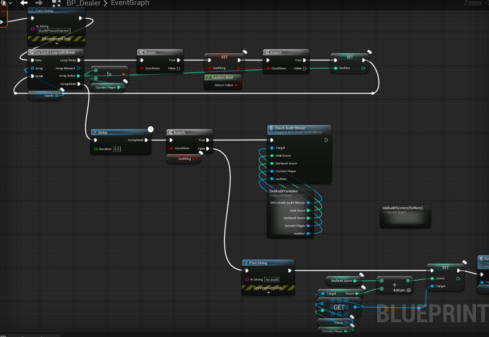
*Figure 11: Start of Audit Phase blueprinting and attempts to get relevant variables*

#### Iterative Debugging and Technical Fixes

This triggered a grueling, iterative testing process. Troubleshooting multiplayer logic in Unreal Engine requires constant back-and-forth between editing Blueprints and launching multi-client PIE (Play In Editor) sessions to observe the network desynchronization in real-time. 

Based on my analysis of the network traffic and Blueprint execution flows, I deduced and implemented several major fixes to the `BP_Dealer` and `BP_FirstPersonCharacter` logic:
1. **Widget Ownership and Client RPCs:** The reason the Auditing UI failed to appear for remote clients was a violation of UI instancing. The server was attempting to draw the UI directly. I refactored the flow so the server instead sends a `Client RPC` (Run on Owning Client) to the specific player whose turn it is to audit. That client's local Player Controller then securely constructs and adds the widget to their specific viewport.
2. **Authoritative Economic Calculations:** The money synchronization failure was a classic race condition. Clients were calculating their own math locally before the server confirmed the audit result. I stripped all economic math from the client side. Now, when an audit is called, the server executes the math, updates the replicated `PlayerMoney` variable, and relies on the `RepNotify` architecture we established in Week 5 to push the updated balance to the clients' screens.

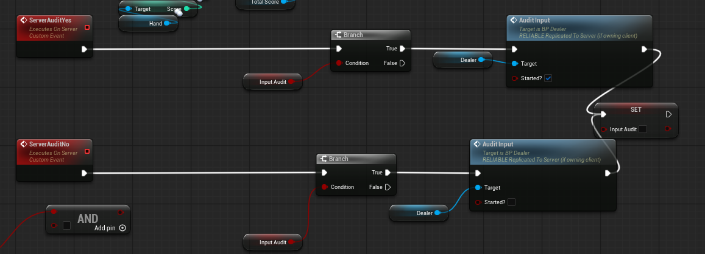
*Figure 12: Moving over to using `Run on Server` Custom Events to get scores to run back to the server.*

Despite these significant technical overhauls and days of iterative testing, the complete macro-loop of the game remained unstable by the end of the week. While the isolated auditing math now replicates correctly, edge cases regarding turn transitions immediately after an audit are still causing the state machine to hang.

# Week 7: Finalizing the Auditing Game Loop

Returning to the engine, this week marked a massive milestone: the core gameplay loop, including the highly volatile Auditing mechanic, is finally functional across the network. 

Because the architecture required to sync UI, player turns, and economic variables simultaneously was incredibly complex, I adopted a highly collaborative workflow this week, working closely alongside two of my classmates, Harry and Bradley. By dividing the workload, Harry focusing on the visual UI layouts, Bradley assisting with the state machine logic, and myself driving the network replication and RPC routing, we were able to break through the bottlenecks that plagued Week 6.

#### The UI Networking Paradigm

The biggest hurdle was ensuring that interactive widgets only appeared for the correct players at the correct times, without the server forcefully drawing UI on non-owning clients. To solve this, we integrated two new specific widget blueprints: `WBP_AuditInput` (where the active player declares their bluff or truth) and `WBP_AuditDecision` (where the opposing player chooses whether to call the bluff).

**The Communication Flow:**
1. **The Trigger:** The server's `BP_Dealer` state machine advances the turn. 
2. **Client RPC (Input):** The server identifies the active player's `PlayerController` and fires a `Client RPC`. This guarantees that *only* the active player's machine constructs and adds `WBP_AuditInput` to their viewport.

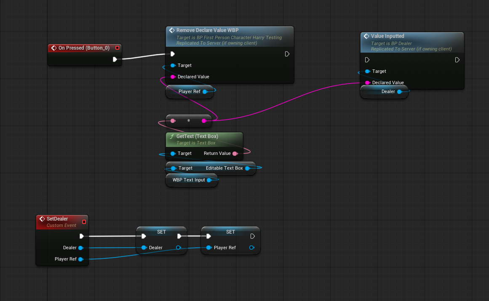
*Figure 12. In-game screenshot of WBP_AuditInput successfully displaying exclusively on the active client's screen during their turn.*

3. **Server Verification:** The player selects their card and clicks submit. The widget tells the `PlayerController` to fire a `Server RPC` containing the selected data. The server receives this, validates the move against the deck array, and temporarily hides the active player's UI.
4. **Targeted Client RPC (Decision):** The server then identifies the *next* player in the turn order sequence. It fires a new `Client RPC` to that specific player's controller, telling their machine to construct `WBP_AuditDecision`. 

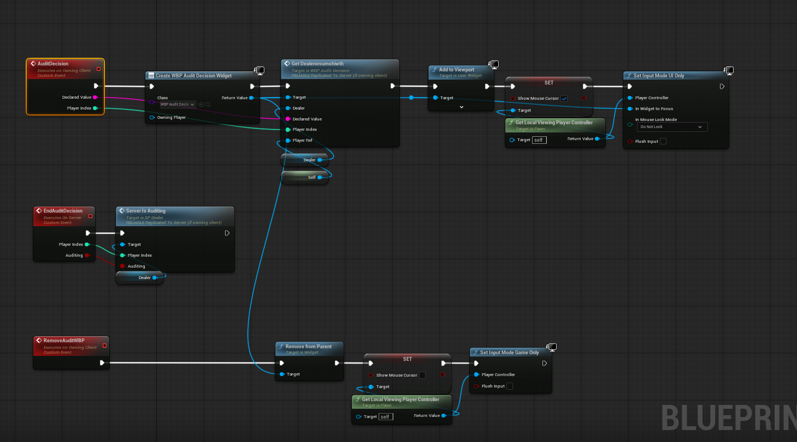
*Figure 13. Blueprint logic demonstrating the construction of WBP_AuditDecision. Note the strict reliance on Owning Client checks before viewport attachment.*


*Figure 14. In-game screenshot of WBP_AuditDecision appearing for the targeted opponent, while the rest of the lobby enters a "waiting" state.*

#### Replicating the Economic Resolution

Once the opposing player interacts with `WBP_AuditDecision` (choosing to "Call Bluff" or "Pass"), they fire a final `Server RPC`. This is where the mathematical resolution we struggled with last week finally clicked into place.

Because the server holds the absolute truth of what card was *actually* played versus what card was *claimed*, it calculates the audit outcome entirely isolated from the clients. It determines who gains and loses money, updates the `Replicated` integer variables on both players' Character blueprints, and triggers the `RepNotify` functions. 

Because we routed this entirely through the server's state machine rather than relying on the widgets to do the math, the synchronization is now flawless. All players see the money totals update simultaneously, and the `BP_Dealer` cleanly iterates the turn index to the next player, looping the game state.

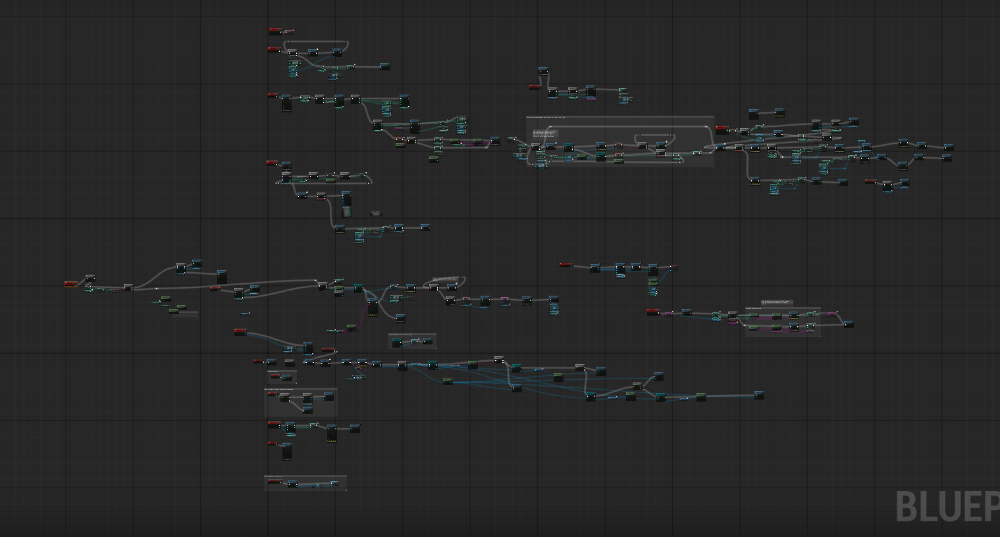
*Figure 15. The finalized BP_Dealer macro-loop, showcasing the server-authoritative logic that connects the Audit Decision back into the primary turn iteration.*

### Reflection and Next Steps

Collaborating tightly with Harry and Bradley this week proved that complex networking issues are often solved through clear architectural planning and team communication, rather than brute-force coding. We transitioned from a broken, desynchronized prototype to a fully playable, networked game loop. Moving into Week 8, the focus will shift entirely to polish: adding visual flair, sound effects (utilizing the audio we recorded in Week 3), and ensuring the lobby seamlessly transitions into this finalized gameplay map.

---

# Week 9: Archetype System Integration and Dynamic Asset Loading

### Part 1: The Archetype System and Component Architecture

As we approached the final stages of production, the focus shifted from pure mechanical networking to audio-visual polish. Back in Week 3, we spent a day in the recording studio capturing bespoke voice lines for our different characters. To implement these, along with their unique 3D meshes, the project required a robust "Archetype" system, a data-driven framework that defines which character a player has selected and handles the loading of their specific assets.

To maintain a clean codebase and adhere to the single-responsibility principle, this logic was encapsulated within a custom actor component: `BP_ArchetypeComponent`. Rather than bloating the `BP_FirstPersonCharacter` with mesh-swapping and audio-routing logic, this component attaches to the player and handles all archetype-specific behaviors independently.

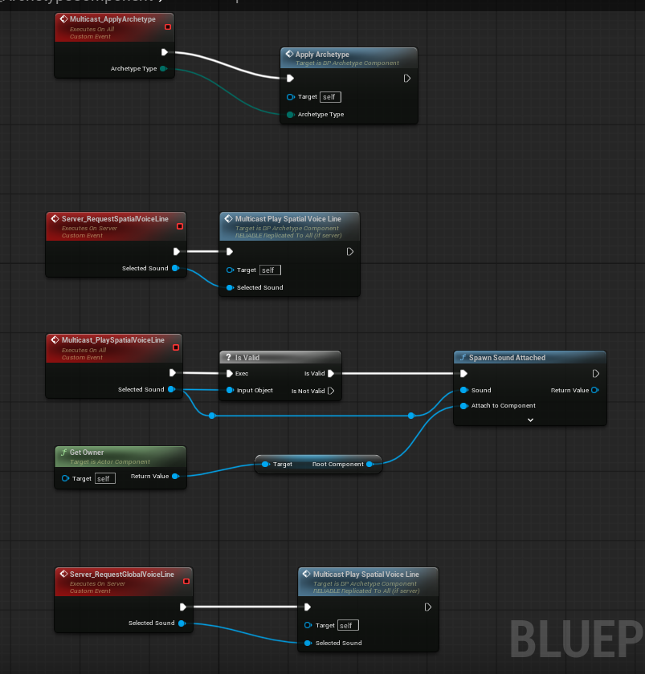
*Figure 13: Verification that all `BP_ArchetypeComponent` was using Run on Server custom events to ensure the BP_Dealer could properly recieve everything.

### Part 2: Collaborative Debugging with Zoe

While the `BP_ArchetypeComponent` was structurally sound, integrating it into the live multiplayer environment surfaced several critical replication issues. Players were spawning in, but their selected meshes were not updating for remote clients, and the custom voice lines were failing to trigger during gameplay events. 

To resolve this, I paired up with Zoe to audit the component's initialization flow. We discovered that the archetype data was suffering from a race condition; the client's component was attempting to load the mesh and audio data before the server had successfully assigned their Player State.

**The Fix: `InitialiseArchetypeFromPlayerState`**
We restructured the initialization logic within `BP_ArchetypeComponent`. Instead of firing on `BeginPlay`, we created a custom event (`InitialiseArchetypeFromPlayerState`) that strictly waits for the server to validate the player's unique ID and archetype selection. Once the server replicates this data variable, an `OnRep` function triggers the component to dynamically load the correct skeletal mesh and bind the corresponding audio cues.

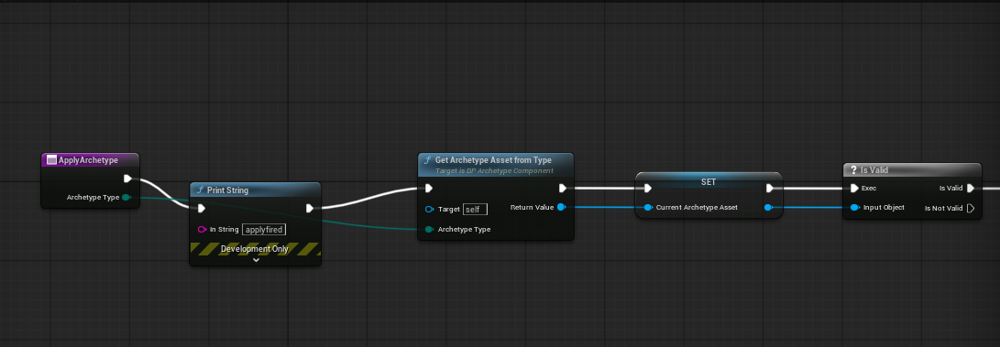
*Figure 14. The refactored initialization logic within BP_ArchetypeComponent, ensuring assets only load after the Player State is fully synchronized across the network.*

### Part 3: Hooking Assets into the `BP_Dealer` State Machine

With the `BP_ArchetypeComponent` reliably loading the correct data, the final hurdle was integrating this system into the `BP_Dealer`'s macro-loop. The game design required characters to dynamically react to the game state, for instance, playing a specific voice line when they place a card, or triggering a unique reaction when they are audited.

Because the `BP_Dealer` acts as the ultimate authority over the game's state machine, it needed to be the blueprint responsible for commanding these audio-visual cues. 

Working through the `BP_Dealer` event graph, I set up dynamic references to the active player's `BP_ArchetypeComponent`. When the state machine reaches a critical phase (e.g., a bluff is called), the `BP_Dealer` identifies the targeted player, accesses their specific Archetype Component, and fires custom events like `TriggerPlaceCard` or `TriggerSelectCard`. 

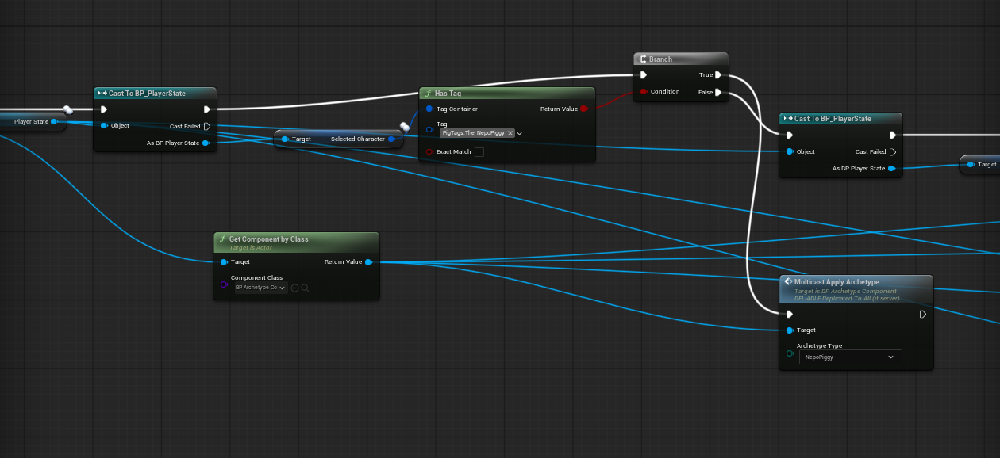
*Figure 15. The BP_Dealer blueprint dynamically accessing the active player's Archetype Component to trigger synchronized voice lines during turn transitions.*

Because the server is commanding the execution of these events, we were able to utilize Multicast RPCs within the `BP_ArchetypeComponent` to play the specific 3D spatialized voice lines. This ensures that when a player makes a move, every client in the lobby hears the correct character's voice emanating from the correct position in the 3D space.

### Reflection and Next Steps

Week 9 was a highly rewarding sprint that finally brought the raw assets from our early production weeks into the live engine environment. Collaborating closely with Zoe to bridge the gap between data components and the `BP_Dealer` state machine reinforced the importance of modular architecture in Unreal Engine. By isolating the character data into `BP_ArchetypeComponent`, we prevented the `BP_Dealer` from becoming an unmanageable "god class." With the characters now fully realized and communicating, the final week will be dedicated to final bug fixing, balancing, and preparing the build for its final Steam deployment.


# Week 10 - Final Testing and Critical Reflection

For Week 10 the game was still in a vastly unfinished state and things were not looking good. Despite all my efforts in the previous week certain aspects of gameplay were not working, things like the win and loss conditions triggering properly to end the game didn't work and we were still having some replication issues regarding the scores displaying. 

I wanted to fix this however simply did not have the time to do so due to time constraints and simply taking too long to fix it so I had to leave the game as it was and make sure it was as ready as it could be to upload to steam. 

## Critical Reflection

### What went well? 

I think that for a large majority of the project I was always learning something new, whether that was teaching myself things like networking sessions in weeks 2 and 3 or experimenting with replication and instances for things like the player spawning methods in weeks 4 and 5. It served as a good experience to constantly adapt to what was being asked of me and to continue. 

I also think my efforts with Bradley and Harry throughout weeks 4 to 7 and with Zoe in weeks 7 and 9 to do paired programming to better finish off multiplayer systems or archetype systems respectively was a good example of how successful working with others can be. It was completed significantly quicker than if I were to just tackle it alone and having multiple eyes constantly reviewing my code and then passing it off when I got stuck was a great method.

### What could be improved or done differently next time? 

Reflecting on the project, the most persistent hurdle was the absence of a unified central authority. We lost significant development time navigating a "too many cooks" scenario, where having ten parallel project leads created tangled communication webs just to reach a single milestone. This friction could have been entirely avoided by electing one definitive project director, who could have then formally delegated specific departmental roles (e.g., UI Lead, Multiplayer Lead) to streamline decision-making.

Furthermore, the lack of agency over foundational decisions crippled the project from day one. Although pitched as a student-led initiative, the team had practically no input regarding the game's core concept, genre, or engine choice. Resentment grew quickly when we were handed an AI-generated brief that was essentially a carbon copy of Liar's Bar, with no room for unique creative iteration. This severely damaged team morale; it often felt like we were pouring our effort into building a lesser clone of an existing game rather than something original.

This lack of consultation extended to the engine selection, which was deeply frustrating given my role. As the Multiplayer Lead responsible for architecting and maintaining the network framework, being forced into Unreal Engine added unnecessary technical friction. I understand the decision was made to accommodate designers unfamiliar with Unity. However, for a mechanically simple multiplayer card game, Unity would have been a far more efficient, logical choice, ultimately yielding a more stable final product. Since the designers rarely interacted with the source code anyway, adapting to Unity’s UI and level design workflows would have been a highly reasonable trade-off in exchange for better multiplayer architecture.

In terms of what I could've done different I think some larger research into multiplayer architecture in Unreal would've benefitted me. I didn't realise how big of an undertaking multiplayer would be and would've dedicated much more time to solely focusing on multiplayer had I known.