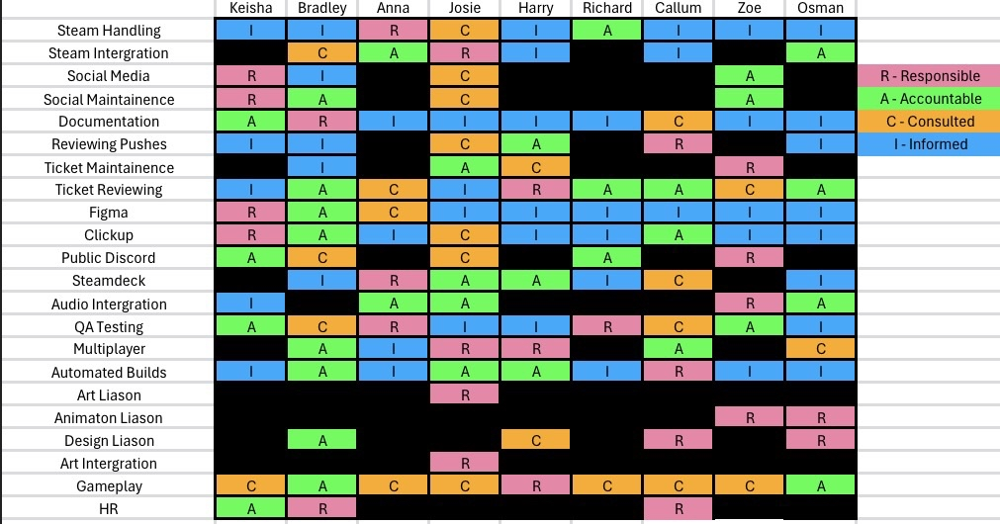
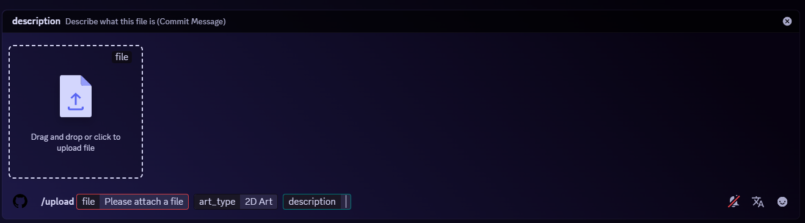
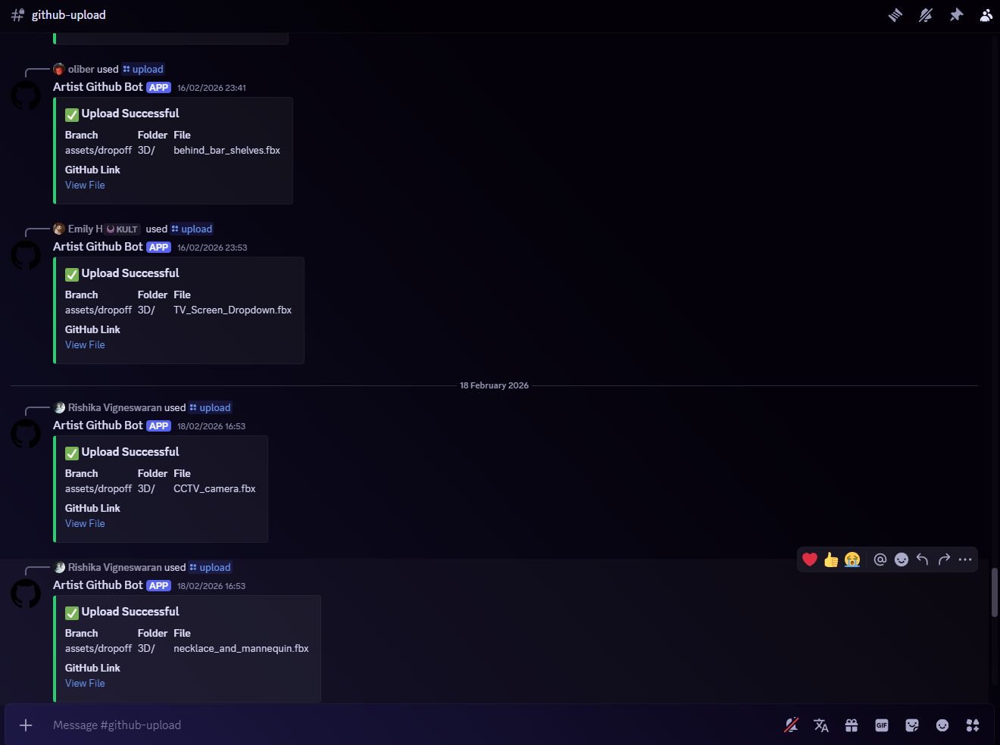

## Week 1 - Setup and Version Control Pipeline

### Project Context and Production Framework

The primary objective for this 10-week cycle is to develop and publish a multiplayer game to Steam. To accurately emulate a real-world studio environment, the course is structured as a professional company simulation. My assigned role heavily focuses on technical production—specifically architecting asset integration pipelines, managing version control for non-technical staff, and handling the Steam backend administrative tasks.

Going into pre-production, we were provided with a client brief detailing the game's style and parameters. We established that we are developing a multiplayer card game, mechanically and thematically inspired by titles such as ***(Liar’s Bar on Steam, s.d.)*** and traditional rulesets like ***(Cheat / I Doubt It - Card Game Rules, s.d.)***. Because of the rapid development cycle and the complexity of coordinating multiple disciplines, robust pre-planning was essential before moving into the engine.

To formalize our studio hierarchy and ensure clear communication, we adopted standard project management methodologies, starting with a RACI chart. This matrix explicitly defines who is Responsible, Accountable, Consulted, and Informed across every major project milestone.


*Figure 1. RACI Chart established during the initial sprint planning to map out studio responsibilities.*

### Identifying the Pipeline Bottleneck

With the administrative foundation set, I immediately began developing my first technical tool. Anticipating a very common production bottleneck, I recognized that our 2D artists and 3D animators would likely experience high friction when interacting directly with Git and GitHub. Version control command-line interfaces (CLIs) and desktop clients can be overwhelming for non-programmers, often leading to merge conflicts, misnamed directories, or lost assets. 

To mitigate this risk, I set out to engineer a frictionless middle-man tool: a Discord Bot that allows artists to push assets directly into our repository from an environment they already use daily.

### Engineering the Discord-to-GitHub Bridge

To build this integration, I had to research both Discord's native application developer tools ***(Intro, s.d.)*** and the GitHub REST API, specifically focusing on authenticating external software via Personal Access Tokens ***(Hoglund, 2023)***.

Using my prior experience with Python, I developed an automated asset ingestion pipeline. The bot intercepts user uploads in Discord, formats the metadata, authenticates with GitHub, and pushes the payload directly to the correct remote directory. 

I made several key technical decisions to ensure the tool was robust and secure:
* **Secrets Management:** I utilized the `dotenv` library to keep my Discord API keys and GitHub tokens entirely separate from the codebase. This prevents sensitive credentials from being leaked into the repository.
* **Segmented Authentication:** I implemented two separate GitHub tokens (`TOKEN_2D` and `TOKEN_3D`). This allows for better security scoping and theoretically allows leads to track which department is pushing assets.
* **Asynchronous Handling:** The `/upload` command utilizes `interaction.response.defer(thinking=True)`. Because large art assets take time to buffer and upload, deferring the response prevents the Discord API from timing out and crashing the script.
* **Proactive File Size Validation:** I added a strict 25MB check (`if file.size > 25 * 1024 * 1024`). Discord has attachment limits, and GitHub has file size caps before requiring Git LFS. Catching this early prevents silent API failures.

```python
import discord
from discord import app_commands
from discord.ext import commands
from github import Github
import os
from dotenv import load_dotenv
load_dotenv()

DISCORD_TOKEN = os.getenv('DISCORD_TOKEN')
REPO_NAME = "University-for-the-Creative-Arts/Greedy_Piggies"
TARGET_BRANCH = "assets/dropoff"

TOKEN_2D = os.getenv('GITHUB_TOKEN_2D')
TOKEN_3D = os.getenv('GITHUB_TOKEN_3D')

intents = discord.Intents.default()
bot = commands.Bot(command_prefix="!", intents=intents)

@bot.event
async def on_ready():
    print(f'Logged in as {bot.user}!')
    try:
        synced = await bot.tree.sync()
        print(f"Synced {len(synced)} command(s)")
    except Exception as e:
        print(e)

def push_to_github(file_bytes, filename, commit_message, art_type):
    
    if art_type == "2D":
        g = Github(TOKEN_2D)
        folder = "DropOff/2D"
    
    elif art_type == "Animation":
        g = Github(TOKEN_3D) 
        folder = "DropOff/ANIMATION"
        
    else:
        g = Github(TOKEN_3D)
        folder = "DropOff/3D" 

    try:
        repo = g.get_repo(REPO_NAME)
        
        path_in_repo = f"{folder}/{filename}"

        repo.create_file(
            path=path_in_repo,
            message=f"[{art_type}] {commit_message}", 
            content=file_bytes,
            branch=TARGET_BRANCH 
        )
        
        return True, f"[https://github.com/](https://github.com/){REPO_NAME}/blob/{TARGET_BRANCH}/{path_in_repo}"
    
    except Exception as e:
        return False, str(e)

@bot.tree.command(name="upload", description="Upload an asset to the assets/dropoff branch")
@app_commands.describe(
    file="The file you want to upload",
    art_type="Is this 2D, 3D, or Animation?",
    description="Describe what this file is (Commit Message)"
)
@app_commands.choices(art_type=[
    app_commands.Choice(name="2D Art", value="2D"),
    app_commands.Choice(name="3D Art", value="3D"),
    app_commands.Choice(name="Animation", value="Animation"),
])
async def upload(interaction: discord.Interaction, file: discord.Attachment, art_type: app_commands.Choice[str], description: str):
    
    await interaction.response.defer(thinking=True)

    # Check file size (25MB limit warning)
    if file.size > 25 * 1024 * 1024: 
        await interaction.followup.send("Warning: Large file detected. This might take a moment.")

    file_bytes = await file.read()

    success, result = push_to_github(
        file_bytes=file_bytes, 
        filename=file.filename, 
        commit_message=description, 
        art_type=art_type.value
    )

    if success:
        embed = discord.Embed(title="Upload Successful", color=discord.Color.green())
        embed.add_field(name="Branch", value=TARGET_BRANCH, inline=True)
        embed.add_field(name="Folder", value=f"{art_type.value}/", inline=True)
        embed.add_field(name="File", value=file.filename, inline=True)
        embed.add_field(name="GitHub Link", value=f"[View File]({result})", inline=False)
        await interaction.followup.send(embed=embed)
    else:
        if "404" in result and "Reference" in result:
             await interaction.followup.send(f"❌ **Error:** Branch '{TARGET_BRANCH}' not found. Please double-check the branch name.")
        else:
             await interaction.followup.send(f"❌ **Error Uploading:** {result}")

bot.run(DISCORD_TOKEN)

```

*Figure 2. Github Discord Bot successfully integrated into the main studio server.*


*Figure 3. The dedicated #github-upload channel. This interface not only strips away the complexity of Git for artists but also acts as a visual log for leads to monitor asset integration in real-time.*

### Deployment and Next Steps

For Phase 1 of deployment, I temporarily hosted the bot locally via my PC terminal. While this constraint meant the bot was only active while my machine was on, it served as a highly effective prototyping environment to test the API logic and routing systems before committing to a permanent server solution. Moving into Week 2, exploring dedicated cloud hosting options for 24/7 uptime will be a priority, alongside researching how the `PyGithub` library handles file updating to avoid collisions when artists iterate on existing assets.

---

# BIBLIOGRAPHY

*(In order they appear in the writeup)*

Liar’s Bar on Steam (s.d.) At: https://store.steampowered.com/app/3097560/Liars_Bar/ (Accessed  23/02/2026).

Cheat / I Doubt It - Card Game Rules (s.d.) At: https://www.pagat.com/beating/cheat.html (Accessed  23/02/2026).

Intro (s.d.) At: https://docs.discord.com/developers/intro (Accessed  23/02/2026).

Hoglund, T. (2023) Remote Authentication using Personal Access Tokens on GitHub.com. At: https://blog.devops.dev/remote-authentication-using-personal-access-tokens-on-github-com-e707646d2f8b (Accessed  23/02/2026).