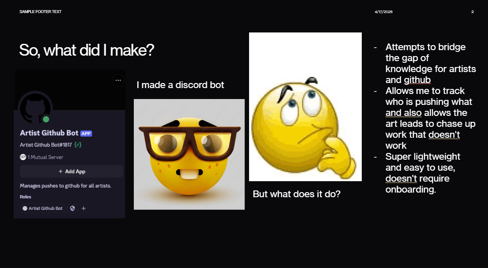
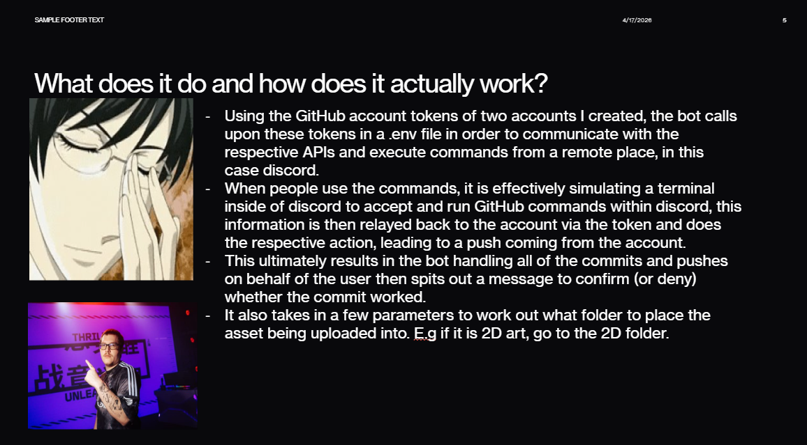
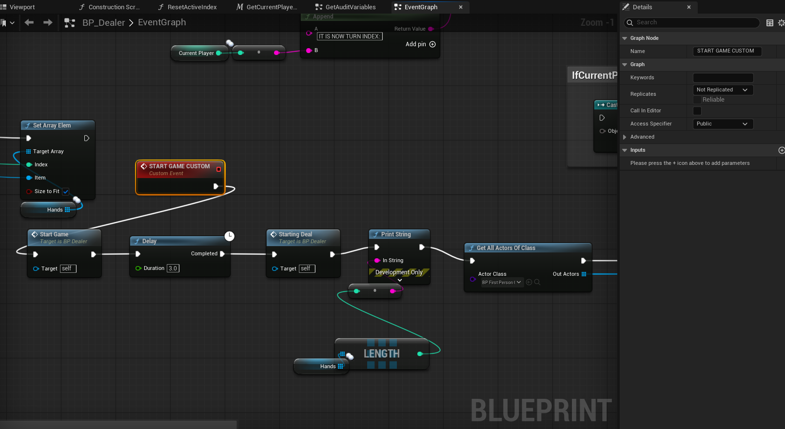
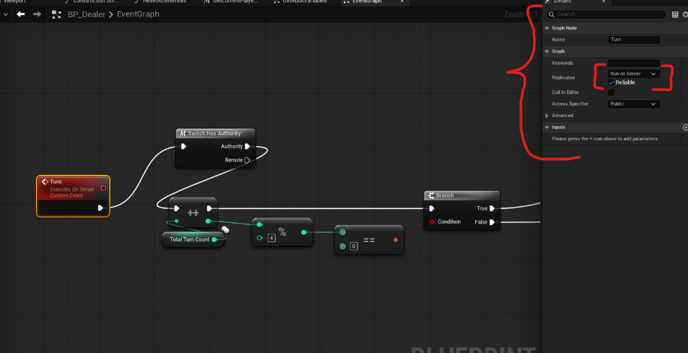
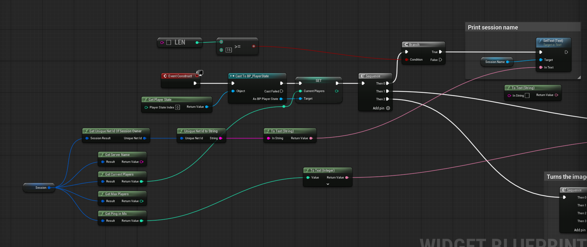

## Week 4 - Pipeline Presentation & Multiplayer State Synchronization

### Part 1: Tool Presentation and Handover

A core responsibility of a technical production role is not just building tools, but ensuring the team understands how to use them. I began Week 4 by delivering a formal presentation to the rest of the class, demonstrating the Discord-to-GitHub asset ingestion bot I had engineered over the previous weeks. 

The presentation covered the pipeline's architecture, its integration with Git LFS, and a live demonstration of how artists can use it to bypass complex Git desktop clients. Communicating technical workflows to non-technical disciplines is a critical soft skill in agile development environments, ensuring the tool actually reduces friction rather than adding to it.

*Figure 5. Slide from my pipeline presentation outlining the data flow between Discord, the local staging environment, and the GitHub repository.*

*Figure 6. Slide demonstrating the user-facing output and error handling designed for the art team.*

(yes this is actually the presentation I gave in class lol)

### Part 2: Multiplayer Replication - The Dealer System

Transitioning back to active engine development, my primary technical objective was syncing the core gameplay loop across the network. A classmate had previously authored a foundational version of the `BP_Dealer` blueprint. However, it was built for local execution. In a multiplayer card game, network authority is paramount; if clients handle their own card dealing, the game is immediately vulnerable to cheating and desynchronization *(Ruiz, 2017)*.

I took ownership of `BP_Dealer` and overhauled its architecture to operate on a strict Client-Server model using Unreal's Remote Procedure Calls (RPCs). 

**Technical Refactoring:**
* **Server Authority:** The array representing the deck of cards exists strictly on the server. Clients do not know the order of the deck.
* **Custom Events (RPCs):** I implemented "Run on Server" custom events. When a player presses a button to draw or interact, their Player Controller sends an RPC to the server. The server executes the logic (e.g., popping an array element from the deck) and assigns the card.
* **Multicasting Gameflow:** Once the server validates the action, it triggers a "Multicast" custom event, instructing all connected clients to play the visual dealing animation and update their UI simultaneously. This ensures the game state remains identical for every player in the session *(Epic Games, s.d.-a)*.

*Figure 7. The BP_Dealer blueprint showcasing the transition from local logic to Server-Authoritative Custom Events for card distribution.*

### Part 3: Server Browser and Player ID Resolution

Alongside the gameplay networking, I revisited the multiplayer UI architecture established in Week 2. During initial playtesting of our Steam integration, we encountered a critical bug: when clients joined a hosted server via the server browser, their Player IDs (Unique Net IDs) were not being assigned or passed correctly, breaking player identification in the lobby.

I traced the issue to how the session data was being parsed within the UI widget. I upgraded the `WB_ServerBrowserItem` blueprint to properly handle the `Blueprint Session Result`. 

**The Fix:** When the list populates, the widget now explicitly extracts and stores the correct Session ID and host data. When the client clicks "Join," the widget reliably passes this verified session reference to the `Join Session` node, ensuring the Steam Online Subsystem successfully negotiates the connection and properly registers the client's Unique Net ID upon entering the server *(Epic Games, s.d.-b)*.

*Figure 8. Upgraded WB_ServerBrowserItem logic, demonstrating the correct extraction and passing of session data to ensure Player IDs initialize correctly on join.*

### Reflection and Next Steps

This week successfully bridged the gap between pipeline tooling and gameplay programming. Refactoring the `BP_Dealer` to rely on server authority secures the integrity of our game, and fixing the server browser UI ensures players can actually connect to test it. Moving into Week 5, my goal will be to finalize the lobby transition sequence so that once all players have successfully joined the session with their correct IDs, the server can seamlessly seamless-travel everyone into the active game map.

---

# BIBLIOGRAPHY

*(In order they appear in the writeup)*

Ruiz, J. M. (2017) *Multiplayer Game Development with Unreal Engine 4*. Birmingham: Packt Publishing.

Epic Games (s.d.-a) *RPCs in Unreal Engine*. At: https://dev.epicgames.com/documentation/en-us/unreal-engine/rpcs-in-unreal-engine (Accessed 17/04/2026).

Epic Games (s.d.-b) *Session Interface in Unreal Engine*. At: https://dev.epicgames.com/documentation/en-us/unreal-engine/session-interface-in-unreal-engine (Accessed 17/04/2026).