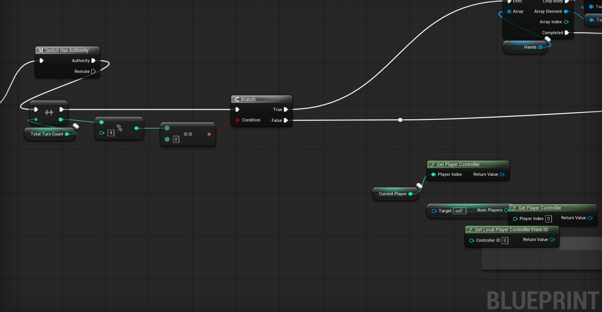
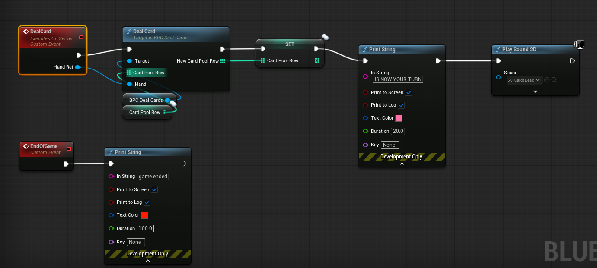
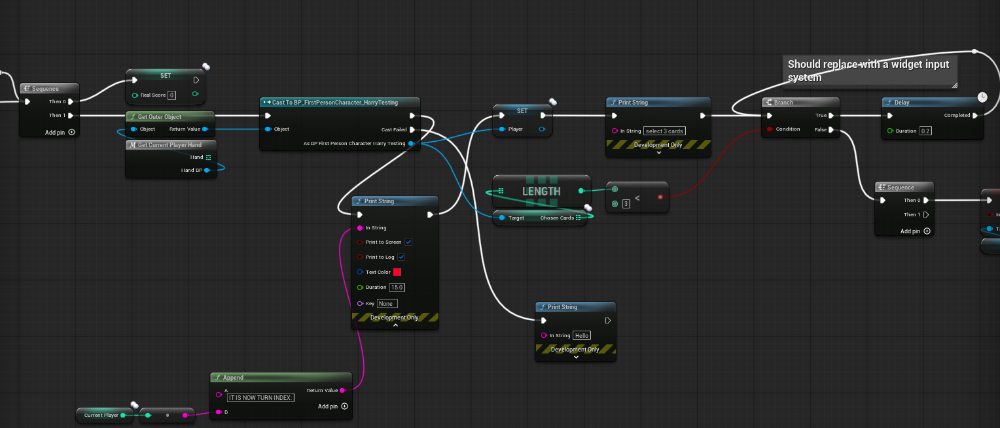
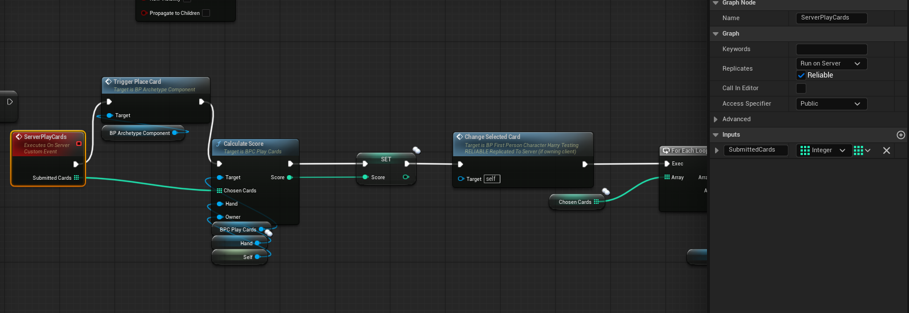
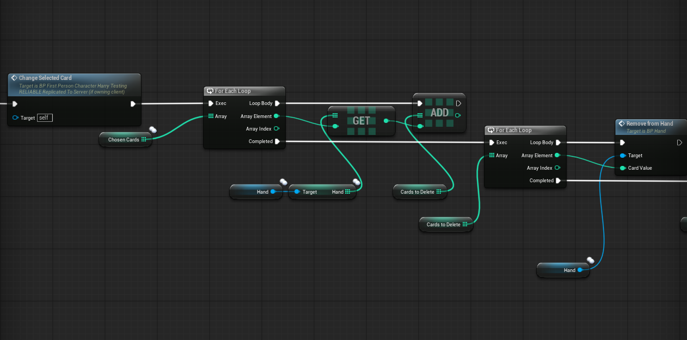
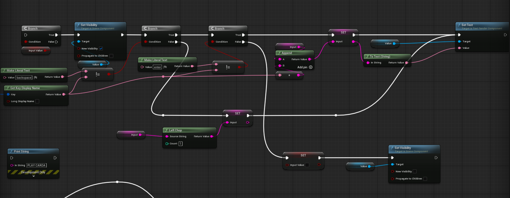

## Week 5 - API Architecture and Server-Authoritative Gameplay Replication

### Part 1: API Design - Asset Ingestion Microservice

Before fully transitioning my focus back to in-engine development, I completed a formal architectural exercise mandated by the unit brief: designing a public-facing RESTful Web API for our Discord-to-GitHub pipeline tool. 

Currently, the Discord bot operates as a monolithic, localized script. However, in a professional production environment, decoupling the front-end user interface (Discord) from the back-end processing logic (Git LFS operations) is a crucial standard. By designing this as a distinct microservice, the pipeline becomes significantly more robust, scalable, and secure *(Fielding, 2000)*. It also opens the door for future integrations—for example, we could eventually author a custom Unreal Engine plugin that hits this exact same API to push assets to GitHub directly from within the editor, bypassing Discord entirely.

**Endpoint Overview & Architectural Justification:**
* **URL:** `/api/v1/assets/upload`
* **HTTP Verb:** `POST`
* **Description:** This endpoint is designed to be stateless. It receives a JSON payload containing metadata and a direct download URL for an asset. The server then fetches the file, routes it to the correct project folder based on a strict `art_type` enum, and commits it to the remote repository via Git Large File Storage (LFS). By offloading the file processing to a dedicated web service, we prevent the Discord client from timing out or hitting memory limits during massive file uploads.

**Example Request & Response Specifications:**
To document the API's call flow for potential future integration by other developers on the team, I mapped out the minimal JSON payloads required to communicate with this endpoint. 

```JSON
// Example Minimal Request
POST /api/v1/assets/upload HTTP/1.1
Content-Type: application/json
Authorization: Bearer <API_ACCESS_TOKEN>

{
  "author_id": "847293847281",
  "art_type": "3D",
  "commit_message": "Updated hero pig character mesh",
  "file_name": "hero_pig_v2.fbx",
  "file_url": "https://cdn.discordapp.com/attachments/..."
}

// Example Minimal Response (Success)
HTTP/1.1 200 OK
Content-Type: application/json

{
  "status": "success",
  "message": "Asset successfully committed to assets/dropoff",
  "data": {
    "github_url": "https://github.com/University-for-the-Creative-Arts/Greedy_Piggies/blob/assets/dropoff/DropOff/3D/hero_pig_v2.fbx",
    "commit_hash": "7a8b9c0d1e2f3g4h5i"
  }
}
```

**API Reference & Parameter Documentation:**
* `author_id` **(String, Required)**: The Discord ID or unique user identifier. Crucial for establishing a non-repudiable audit trail in the event a corrupted asset breaks the engine build.
* `art_type` **(String, Required)**: A strict enum dictating the routing path (`"2D"`, `"3D"`, or `"Animation"`). This prevents users from arbitrarily creating unauthorized directories in the repository.
* `commit_message` **(String, Required)**: A semantic description of the asset changes for version tracking.
* `file_name` **(String, Required)**: The target file name including its extension.
* `file_url` **(String, Required)**: An authenticated URL where the microservice can securely fetch the raw bytes.
* **Returns:** A structured JSON Object containing a `status` string and a `data` object with the `github_url` and `commit_hash` for immediate user feedback.
* **Failure Cases Handled:** * `400 Bad Request`: Fired if an invalid enum is provided.
    * `401 Unauthorized`: Fired if the Bearer token in the header is missing or invalid, ensuring only authorized team members can push to the repository.
    * `413 Payload Too Large`: Fired if the target file exceeds the server's designated disk-cache capacity.

---

### Part 2: State Synchronization and Gameplay Replication

Returning to the Unreal Engine project, Week 5 was a heavy production sprint focused on the complexities of network replication. With our Steam session architecture successfully establishing connections last week, the primary objective was now syncing the actual gameplay state—specifically card dealing, turn orders, and scoring—across all connected clients.

#### Synchronizing the Dealer and Turn Management

In a multiplayer card game, enforcing a strict "Server-Authoritative" network model is non-negotiable. If clients are trusted to manage their own decks, hands, or turn states, the game becomes fundamentally vulnerable to desynchronization and malicious exploitation (cheating) *(Ruiz, 2017)*. 

Building upon the `BP_Dealer` blueprint introduced previously, I engineered a highly deterministic turn-based flow. The server holds the absolute truth regarding the deck array and a tracking integer representing the current active player's turn. 

When a client attempts to draw a card or play a hand, their input sends a "Run on Server" Remote Procedure Call (RPC). The server does not blindly accept this request. Instead, it first checks the turn integer to validate if it is legally that player's turn. Only if this server-side validation passes does the server modify the deck array and deal the card. This ensures "dumb clients"—they only request actions and display visual results, while the server handles all logical arbitration.




*Figure 9. BP_Dealer logic expanding on the Server-Authoritative turn validation. Notice the strict gating logic where the server acts as the absolute arbiter of game flow.*

#### Replicating Player State: RepNotify vs. Multicast

To handle persistent player-specific data, such as tracking individual points, I utilized the `BP_FirstPersonCharacter_HarryTesting` blueprint. A critical production requirement was ensuring that when a player scores, every other client's UI updates synchronously.

Initially, one might consider using a Multicast RPC to broadcast a "Update Score" event to all clients. However, this is a poor architectural choice for critical game state data. Multicast RPCs are transient; if a client experiences temporary packet loss or joins the session late (JIP - Join In Progress), they will miss the Multicast and their score UI will permanently desync. 

Instead, I explicitly utilized Unreal's **Variable Replication** paired with a `RepNotify` function *(Epic Games, s.d.)*:
1. I designated the `PlayerScore` integer as a `Replicated` variable.
2. I configured it to trigger the `OnRep_PlayerScore` function whenever its value changes.
3. When the server increments a player's score, the engine automatically guarantees that this new variable state is pushed to all relevant clients. Upon receiving the new value, the client automatically fires the `OnRep` function, which contains the logic to update their local UI widgets. This ensures "eventual consistency" across the network regardless of latency spikes.




*Figure 10. BP_FirstPersonCharacter_HarryTesting showcasing the Replicated Score variable. The RepNotify paradigm ensures the UI remains intrinsically linked to the server's confirmed variable state.*

### Technical Hurdles and Troubleshooting

Transitioning from local logic to networked gameplay introduced a steep learning curve, requiring significant debugging and troubleshooting throughout the week:

1. **Dropped RPCs and Actor Ownership:** My most time-consuming roadblock occurred when clients pressed the input to draw a card, but the server completely ignored the request. Using `Print String` nodes with Authority switches, I diagnosed this as an Actor Ownership violation. In Unreal Engine, a client can only execute a "Run on Server" RPC on an Actor they explicitly own (such as their `PlayerController` or possessed `Pawn`) *(Glazer and Madhav, 2015)*. Because the `BP_Dealer` is an item placed in the world, the server owns it, causing it to automatically drop client RPCs to prevent spoofing. I resolved this architectural flaw by routing the player's input request through their possessed `BP_FirstPersonCharacter`, which *does* have ownership, and having the Character execute the server function on the Dealer reference.
2. **Listen-Server UI Desynchronization:** During live testing, I noticed that the host player's score UI was not updating, even though the connected clients saw the host's score increase perfectly. Through further research into the engine's network framework, I realized that `RepNotify` functions do not automatically execute on the server when the variable changes; they are designed to only fire on remote clients receiving the network update. I patched this by structuring the logic so the server manually calls the UI update function immediately after it increments its own score variable, ensuring visual parity between the host and the clients.

### Reflection and Next Steps

This week was highly demanding but resulted in a massive leap forward for the project's technical viability. Troubleshooting the strict rules of actor ownership and mastering the nuances of `RepNotify` vs. RPCs has fortified the multiplayer foundation of our pipeline. Moving into Week 6, my primary goal will be to finalize the end-game state conditions. I need to architect a system where, upon the deck depleting or a score limit being reached, the server properly halts all player inputs and replicates a synchronized "Game Over" UI state to all clients simultaneously.

---

# BIBLIOGRAPHY

*(In order they appear in the writeup)*

Fielding, R. T. (2000) *Architectural Styles and the Design of Network-based Software Architectures*. Ph.D. Dissertation. University of California, Irvine.

Ruiz, J. M. (2017) *Multiplayer Game Development with Unreal Engine 4*. Birmingham: Packt Publishing.

Epic Games (s.d.) *Property Replication in Unreal Engine*. At: https://dev.epicgames.com/documentation/en-us/unreal-engine/property-replication-in-unreal-engine (Accessed 17/04/2026).

Glazer, J. and Madhav, S. (2015) *Multiplayer Game Programming: Architecting Networked Games*. Boston: Addison-Wesley Professional.