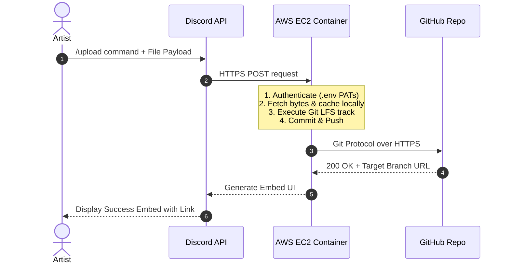

## Week 7 - Production Proposal and Finalizing the Multiplayer Game Loop

### Part 1: Production Deployment Proposal (Task 7)

**To:** Lead Technical Producer  
**From:** Junior Developer  
**Subject:** Production Deployment Proposal: Discord Asset Ingestion Pipeline  

**1. System Overview**
To eliminate version control friction for our non-technical art and audio teams, I have engineered an automated Discord-to-GitHub asset ingestion pipeline. This service allows artists to upload high-fidelity assets (textures, meshes, audio) directly through a Discord channel. The backend microservice intercepts these payloads, routes them to correct directory paths based on strict enums, and executes a Git LFS (Large File Storage) push to our remote repository.

**2. Technical Stack**
* **Frontend Interface:** Discord API (slash commands, embedded UI).
* **Backend Runtime:** Python 3.10+ utilizing `discord.py` and `PyGithub`.
* **Version Control Environment:** Git CLI and Git LFS configured on the host machine.
* **Environment/Containerization:** Docker (to isolate dependencies and ensure parity across testing and production).

**3. Hardware & Cloud Requirements**
To transition this from a localized script on my personal workstation to a highly available production tool, we require a dedicated cloud host.
* **Compute:** A lightweight Linux-based Virtual Private Server (VPS). Given the script relies heavily on network I/O rather than CPU rendering, an **AWS EC2 `t3.micro`** or a basic DigitalOcean Droplet (1GB RAM, 1 vCPU) is sufficient.
* **Storage:** A minimum of 25GB SSD attached storage on the VPS to act as the local staging cache before files are pushed and purged. 
* **Backend Services:** GitHub Pro/Team environment with active Git LFS Data Packs.

**4. Estimated Costs**
* **Initial Setup Costs:** ~$0. The pipeline relies entirely on open-source libraries and pre-existing studio communication tools (Discord). Setup requires approximately 4-6 developer hours to containerize via Docker and deploy.
* **Ongoing Operational Costs:**
    * **Compute Hosting (AWS EC2 / Droplet):** ~$5.00 to $8.00 / month.
    * **GitHub LFS Data Packs:** GitHub provides 1GB of LFS storage/bandwidth for free. In production, we will exceed this rapidly. LFS Data Packs cost $5.00 / month per 50GB of bandwidth/storage *(GitHub, s.d.)*. Assuming a mid-sized indie production, allocating two packs ($10.00/mo) is a safe baseline.
    * **Total Estimated Monthly Pipeline Cost:** ~$15.00 - $18.00 / month.

**5. Target Platforms**
* **User-Facing:** Discord Desktop, Web, and Mobile clients.
* **Service-Facing:** Ubuntu Linux 22.04 LTS (Cloud Environment).

**6. System Architecture Diagram**

---

# BIBLIOGRAPHY

*(In order they appear in the writeup)*

GitHub (s.d.) *About storage and bandwidth usage - GitHub Docs*. At: https://docs.github.com/en/billing/managing-billing-for-git-large-file-storage/about-storage-and-bandwidth-usage (Accessed 17/04/2026).