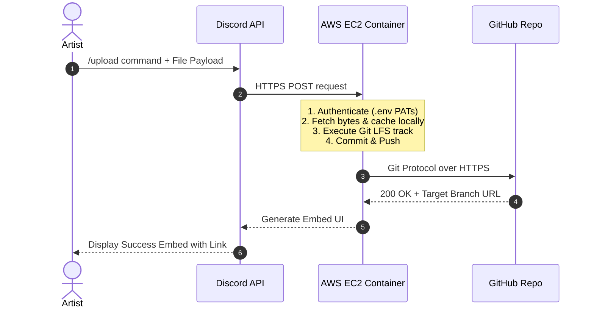

## Week 7 - Production Proposal and Finalizing the Multiplayer Game Loop

### Part 1: Production Deployment Proposal (Task 7)

**To:** Lead Technical Producer  
**From:** Junior Developer  
**Subject:** Production Deployment Proposal: Discord Asset Ingestion Pipeline  

**1. System Overview**
To eliminate version control friction for our non-technical art and audio teams, I have engineered an automated Discord-to-GitHub asset ingestion pipeline. This service allows artists to upload high-fidelity assets (textures, meshes, audio) directly through a Discord channel. The backend microservice intercepts these payloads, routes them to correct directory paths based on strict enums, and executes a Git LFS (Large File Storage) push to our remote repository.

**2. Technical Stack**
* **Frontend Interface:** Discord API (slash commands, embedded UI).
* **Backend Runtime:** Python 3.10+ utilizing `discord.py` and `PyGithub`.
* **Version Control Environment:** Git CLI and Git LFS configured on the host machine.
* **Environment/Containerization:** Docker (to isolate dependencies and ensure parity across testing and production).

**3. Hardware & Cloud Requirements**
To transition this from a localized script on my personal workstation to a highly available production tool, we require a dedicated cloud host.
* **Compute:** A lightweight Linux-based Virtual Private Server (VPS). Given the script relies heavily on network I/O rather than CPU rendering, an **AWS EC2 `t3.micro`** or a basic DigitalOcean Droplet (1GB RAM, 1 vCPU) is sufficient.
* **Storage:** A minimum of 25GB SSD attached storage on the VPS to act as the local staging cache before files are pushed and purged. 
* **Backend Services:** GitHub Pro/Team environment with active Git LFS Data Packs.

**4. Estimated Costs**
* **Initial Setup Costs:** ~$0. The pipeline relies entirely on open-source libraries and pre-existing studio communication tools (Discord). Setup requires approximately 4-6 developer hours to containerize via Docker and deploy.
* **Ongoing Operational Costs:**
    * **Compute Hosting (AWS EC2 / Droplet):** ~$5.00 to $8.00 / month.
    * **GitHub LFS Data Packs:** GitHub provides 1GB of LFS storage/bandwidth for free. In production, we will exceed this rapidly. LFS Data Packs cost $5.00 / month per 50GB of bandwidth/storage *(GitHub, s.d.)*. Assuming a mid-sized indie production, allocating two packs ($10.00/mo) is a safe baseline.
    * **Total Estimated Monthly Pipeline Cost:** ~$15.00 - $18.00 / month.

**5. Target Platforms**
* **User-Facing:** Discord Desktop, Web, and Mobile clients.
* **Service-Facing:** Ubuntu Linux 22.04 LTS (Cloud Environment).

**6. System Architecture Diagram**

---

### Part 2: Finalizing the Auditing Game Loop

Returning to the engine, this week marked a massive milestone: the core gameplay loop, including the highly volatile Auditing mechanic, is finally functional across the network. 

Because the architecture required to sync UI, player turns, and economic variables simultaneously was incredibly complex, I adopted a highly collaborative workflow this week, working closely alongside two of my classmates, Harry and Bradley. By dividing the workload—Harry focusing on the visual UI layouts, Bradley assisting with the state machine logic, and myself driving the network replication and RPC routing—we were able to break through the bottlenecks that plagued Week 6.

#### The UI Networking Paradigm

The biggest hurdle was ensuring that interactive widgets only appeared for the correct players at the correct times, without the server forcefully drawing UI on non-owning clients. To solve this, we integrated two new specific widget blueprints: `WBP_AuditInput` (where the active player declares their bluff or truth) and `WBP_AuditDecision` (where the opposing player chooses whether to call the bluff).

**The Communication Flow:**
1. **The Trigger:** The server's `BP_Dealer` state machine advances the turn. 
2. **Client RPC (Input):** The server identifies the active player's `PlayerController` and fires a `Client RPC`. This guarantees that *only* the active player's machine constructs and adds `WBP_AuditInput` to their viewport.

*Figure 12. In-game screenshot of WBP_AuditInput successfully displaying exclusively on the active client's screen during their turn.*

3. **Server Verification:** The player selects their card and clicks submit. The widget tells the `PlayerController` to fire a `Server RPC` containing the selected data. The server receives this, validates the move against the deck array, and temporarily hides the active player's UI.
4. **Targeted Client RPC (Decision):** The server then identifies the *next* player in the turn order sequence. It fires a new `Client RPC` to that specific player's controller, telling their machine to construct `WBP_AuditDecision`. 

*Figure 13. Blueprint logic demonstrating the construction of WBP_AuditDecision. Note the strict reliance on Owning Client checks before viewport attachment.*

*Figure 14. In-game screenshot of WBP_AuditDecision appearing for the targeted opponent, while the rest of the lobby enters a "waiting" state.*

#### Replicating the Economic Resolution

Once the opposing player interacts with `WBP_AuditDecision` (choosing to "Call Bluff" or "Pass"), they fire a final `Server RPC`. This is where the mathematical resolution we struggled with last week finally clicked into place.

Because the server holds the absolute truth of what card was *actually* played versus what card was *claimed*, it calculates the audit outcome entirely isolated from the clients. It determines who gains and loses money, updates the `Replicated` integer variables on both players' Character blueprints, and triggers the `RepNotify` functions. 

Because we routed this entirely through the server's state machine rather than relying on the widgets to do the math, the synchronization is now flawless. All players see the money totals update simultaneously, and the `BP_Dealer` cleanly iterates the turn index to the next player, looping the game state.

*Figure 15. The finalized BP_Dealer macro-loop, showcasing the server-authoritative logic that connects the Audit Decision back into the primary turn iteration.*

### Reflection and Next Steps

Collaborating tightly with Harry and Bradley this week proved that complex networking issues are often solved through clear architectural planning and team communication, rather than brute-force coding. We transitioned from a broken, desynchronized prototype to a fully playable, networked game loop. Moving into Week 8, the focus will shift entirely to polish: adding visual flair, sound effects (utilizing the audio we recorded in Week 3), and ensuring the lobby seamlessly transitions into this finalized gameplay map.

---

# BIBLIOGRAPHY

*(In order they appear in the writeup)*

GitHub (s.d.) *About storage and bandwidth usage - GitHub Docs*. At: https://docs.github.com/en/billing/managing-billing-for-git-large-file-storage/about-storage-and-bandwidth-usage (Accessed 17/04/2026).